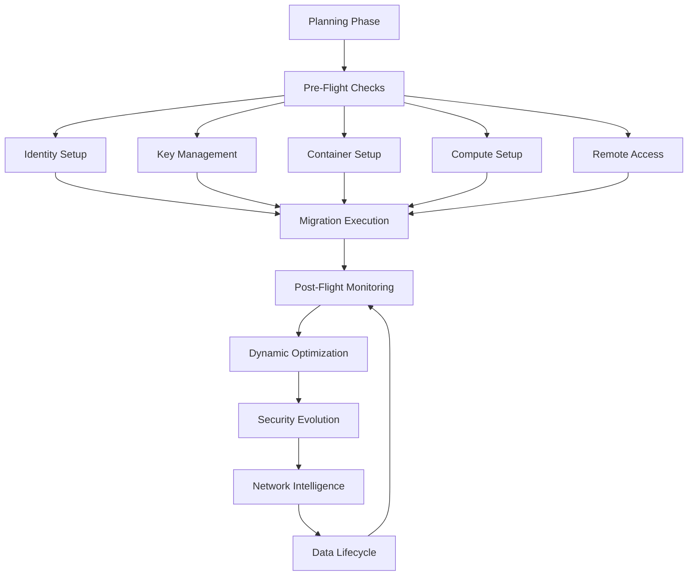

# Sirsi Nexus Comprehensive Development Blueprint (CDB)

**Version:** 1.0.0  
**Last Updated:** 2025-06-25  
**Status:** Active Development  

A dense, end-to-end specification for a production-ready, agent-embedded migration orchestration platform.

---

## Table of Contents

1. [Executive Summary](#1-executive-summary)
2. [Current Development Status](#2-current-development-status)
3. [Core Capabilities & Design Principles](#3-core-capabilities--design-principles)
4. [High-Level Architecture](#4-high-level-architecture)
5. [Phase-by-Phase Roadmap](#5-phase-by-phase-roadmap)
6. [Dynamic Environment Management](#6-dynamic-environment-management)
7. [CI/CD & Testing Matrix](#7-cicd--testing-matrix)
8. [Security & Compliance](#8-security--compliance)
9. [Performance & Monitoring](#9-performance--monitoring)
10. [Release Management](#10-release-management)

---

## 1. Executive Summary

**Goal**: Ship _Sirsi Nexus_—a unified application delivering both a cross-platform desktop single-binary and a multi-tenant hosted web app—automating heterogeneous cloud migrations and infrastructure management. Every user and every feature is supported by the _Sirsi AI Hypervisor_, which dynamically spawns specialized, parallelized _sub‑agents_ (e.g., Azure Agent, AWS Agent, Migration Agent, Reporting Agent, Security Agent, Scripting Agent) to provide deep domain knowledge, continuous monitoring, and context-aware assistance.

**Key Pillars**:

1. **Agent-First Everywhere**: The Hypervisor maintains an always-on _AgentService_ that spawns domain-specific sub-agents. Each sub-agent has full-system visibility in its domain, acts autonomously on tasks (discovery, assessment, planning, execution, reporting), and surfaces recommendations and interactive tutorials.
2. **Modular Polyglot Core**: Leverage Rust (core hypervisor, state machine), Go (connectors, sub-agent runtimes), Python (planning, AI orchestration), TypeScript/WebAssembly (UI logic), and Helm/Terraform for infrastructure. All communicate over protobuf/gRPC and an event bus (Kafka/NATS).
3. **Robust, Feature-Rich UI/UX**: Built with Next.js + React, styled via Tailwind + shadcn/ui, animated using Framer Motion. The sidebar provides one-click access to every module—Discovery, Assessment, Planning, Execution, Validation, Optimization, Reporting, Security, Scripting, FAQs, and Tutorials—each backed by live content and no empty states. A global AgentChat icon injects contextual help into every form, modal, and dashboard.
4. **Security & Compliance by Design**: Zero trust using mTLS and SPIFFE for identity, dynamic secrets via HashiCorp Vault, policy-as-code enforced by OPA at both CI and runtime, and runtime sandboxing of untrusted code modules via gVisor and eBPF-based anomaly detection.
5. **Scalable, Resilient Infrastructure**: Kubernetes Operators to manage migration CRDs, auto-scaling via HPA and custom metrics, multi-region disaster recovery with etcd replication and cross-region object storage, and event-driven workflows for high throughput.
6. **Enterprise-Grade CI/CD & Testing**: Comprehensive GitHub Actions/Azure Pipelines setup for linting (Clippy, ESLint, GoLint), unit tests (Rust, Go, Python, Jest), integration tests (Testcontainers, KIND), end-to-end UI tests (Cypress), security scans (Snyk, Trivy), and performance baselining (K6, Lighthouse).

---

## 2. Current Development Status

### Phase 1: Core Infrastructure ✅ COMPLETED

#### Completed Components:
- ✅ **Basic Rust Core Engine Structure**
  - ✅ Cargo workspace configuration
  - ✅ Dependencies and build configuration
  - ✅ Basic error handling with thiserror
  - ✅ Type aliases (AppError, AppResult)
- ✅ **Authentication System**
  - ✅ User registration with Argon2 password hashing
  - ✅ JWT-based login system
  - ✅ Password verification using modern Argon2 API
  - ✅ Token generation and validation
- ✅ **Database Integration**
  - ✅ PostgreSQL connection setup with SQLx
  - ✅ User model with proper datetime handling
  - ✅ Project model with status enum and Clone trait
  - ✅ Type-safe queries with sqlx macros
- ✅ **API Framework**
  - ✅ Axum web framework setup
  - ✅ Route organization and modular structure
  - ✅ Request/response handling
  - ✅ Debug handlers for development
- ✅ **Data Models**
  - ✅ User model with CRUD operations
  - ✅ Project model with status tracking
  - ✅ Proper datetime handling with time crate
  - ✅ CreateUser, UpdateUser, UserRole types

#### Current Issues Resolved:
- ✅ Fixed argon2 API compatibility
- ✅ Resolved datetime type mismatches (chrono vs time)
- ✅ Added missing type aliases (AppError, AppResult)
- ✅ Fixed project module visibility
- ✅ Added Clone trait to ProjectStatus enum
- ✅ Updated User::create method signature

### Phase 1.5: Frontend Foundation 🔄 IN PROGRESS

#### Completed Components:
- ✅ **Basic Layout Structure**
  - ✅ RootLayout with header and sidebar
  - ✅ Navigation component structure
  - ✅ Responsive design foundation
- ✅ **Authentication Components**
  - ✅ AuthModal with login/register tabs
  - ✅ Form validation and error handling
  - ✅ Integration with backend auth APIs
- ✅ **Project Management**
  - ✅ Projects list view with filtering
  - ✅ Project creation and editing forms
  - ✅ Project detail view with analytics
  - ✅ Task list component integration
  - ✅ Project analytics with charts
- ✅ **Initial Agent Integration**
  - ✅ Basic AgentChat component
  - ✅ Migration steps wizard structure
  - ✅ Contextual help framework

#### In Progress:
- 🔄 **Enhanced Task Management**
  - ✅ TaskList component
  - 🔄 CreateTaskDialog (pending)
  - 🔄 EditTaskDialog (pending)
  - 🔄 Task form shared component (pending)
- 🔄 **Agent Integration Enhancement**
  - ✅ Basic AgentChat component
  - 🔄 Contextual tooltips system
  - 🔄 Input field AI assistants
  - 🔄 Real-time suggestions

#### Pending Frontend Features:
- ⏳ **Migration Wizard Implementation**
  - ⏳ Complete step-by-step workflow
  - ⏳ Agent interactions at each step
  - ⏳ Progress tracking and validation
- ⏳ **Analytics & Reporting**
  - ⏳ Real-time dashboards
  - ⏳ Custom report generation
  - ⏳ Data visualization components
- ⏳ **Help & Tutorial Systems**
  - ⏳ Interactive walkthroughs
  - ⏳ Context-sensitive help
  - ⏳ Video tutorial integration
- ⏳ **Security Dashboard**
  - ⏳ Compliance monitoring
  - ⏳ Security metrics visualization
  - ⏳ Threat detection interface

### Phase 2: AI Hypervisor & Agent Framework ⏳ PENDING

#### Core Components to Implement:
- ⏳ **AgentService gRPC Implementation**
  - Methods: StartSession, SpawnSubAgent, SendMessage, GetSuggestions
  - Context store with Redis cluster
  - Session management and user profiles
- ⏳ **Sub-Agent Manager**
  - Dynamic loading of WASM/Go modules
  - Domain-specific agents (AWS, Azure, Migration, Security, etc.)
  - Kafka/NATS communication bus
- ⏳ **Proto Definitions**
  - AgentService proto files
  - Event schemas for agent communication
  - Versioned API contracts

### Phase 3: Cloud Connectors ⏳ PENDING

#### Provider Integration:
- ⏳ **AWS Agent** (Go implementation)
- ⏳ **Azure Agent** (Go implementation)
- ⏳ **GCP Agent** (Go implementation)
- ⏳ **vSphere Agent** (Go implementation)
- ⏳ **Resource Discovery Events**
- ⏳ **Testcontainers Integration**

---

## 3. Core Capabilities & Design Principles

1. **Full-Stack AI Integration**: Every component embeds an agent for contextual assistance, code generation, and workflow optimization.
2. **Multi-Cloud Discovery**: Automated resource enumeration and relationship mapping across AWS, Azure, GCP, and vSphere.
3. **Risk-Aware Planning**: ML-powered assessment of migration complexity, cost, and security implications.
4. **Infrastructure as Code**: Automated generation and validation of Terraform, Bicep, and Pulumi templates.
5. **Event-Driven Architecture**: Kafka/NATS backbone for real-time progress tracking and agent coordination.
6. **Enterprise-Grade CI/CD & Testing**: Comprehensive GitHub Actions/Azure Pipelines setup for linting, testing, security scans, and performance monitoring.

---

## 4. High-Level Architecture

```text
sirsi-nexus/
├── core-engine/               # Rust: AI hypervisor, sub-agent manager, state machine, gRPC server
├── connectors/                # Go: per-provider adapter runtimes (AWS, Azure, GCP, vSphere)
├── planner/                   # Python: Graph-of-Thought AI orchestration, Dagster pipelines, OPA + ML scorer
├── ui/                        # Next.js + React: pages, modals, dashboards, AgentChat widget
├── cli/                       # Tauri + Rust: local CLI with interactive REPL and agent prompts
├── subagents/                 # Shared logic for spawning and communicating with specialized agents
├── security/                  # OPA policies, SPIFFE/SPIRE configs, Vault templates
├── pipeline/                  # Kafka/NATS setup, OpenTelemetry collector, event schemas
├── migration-templates/       # Terraform, Bicep, Pulumi .tpl files for infrastructure generation
├── testing/                   # Testcontainers definitions, Cypress specs, performance scripts
├── ci/                        # Pipeline definitions, code coverage, security scans
└── deploy/                    # Helm charts, GitOps manifests, desktop bundle configs
```

**Contracts**: All services share versioned proto definitions under `core-engine/proto/*.proto`. Events adhere to schemas in `pipeline/schemas/`.

### 4.1 GUI-First Development Approach

To keep the interface "alive" during early development, the project begins by scaffolding the entire UI and CLI with mocked data. Every screen, modal and dashboard is implemented first, then real services and sub-agents replace the placeholders incrementally. This approach validates workflows early and guides backend priorities.

---

## 5. Phase-by-Phase Roadmap

### Phase 0: Preparation & Monorepo Scaffolding ✅ COMPLETED
- ✅ Initialize unified monorepo with Cargo Workspace
- ✅ Establish CI foundation with GitHub Actions
- ✅ Draft architecture documentation

### Phase 1: Core Engine & API Foundation ✅ COMPLETED
- ✅ Rust core engine with Axum framework
- ✅ Authentication system with JWT and Argon2
- ✅ PostgreSQL database integration with SQLx
- ✅ Basic API endpoints for users and projects
- ✅ Error handling and type safety

### Phase 1.5: UI & Frontend Foundation 🔄 IN PROGRESS
#### 1.1 Design System & Navigation ✅ COMPLETED
- ✅ Tailwind config with design tokens
- ✅ Sidebar component with navigation structure
- ✅ AgentChat overlay foundation

#### 1.2 Core Components & Screens 🔄 IN PROGRESS
- ✅ **AuthModal**: Login/register with validation
- ✅ **ProjectForm**: React Hook Form + Zod validation
- 🔄 **MigrationSteps**: Wizard flow with agent interactions
- 🔄 **WelcomeModal**: Onboarding flow with animations

#### 1.3 CLI Interface ⏳ PENDING
- ⏳ Tauri-based binary with Rust core
- ⏳ Interactive REPL mode with agent autocompletion
- ⏳ CLI subcommands (init, discover, assess, plan, run, status, help)

### Phase 2: Core AI Hypervisor & Sub-Agent Framework ⏳ PENDING
1. **Hypervisor Core (Rust)**
   - Implement AgentService gRPC server
   - Context store with Redis cluster
   - Session management and state persistence
2. **Sub-Agent Manager**
   - Dynamic module loading (WASM/Go binaries)
   - Domain-specific agents: AWS, Azure, Migration, Reporting, Security, Scripting, Tutorial
   - Kafka/NATS communication bus
3. **Knowledge Graph Integration**
   - Hedera Hashgraph client for relationship mapping
   - User interaction and decision persistence
4. **Security Bootstrapping**
   - SPIRE mTLS certificate management
   - Vault sidecar for dynamic secrets
5. **Observability Setup**
   - OpenTelemetry collector deployment
   - Service instrumentation and Kafka topics

### Phase 3: Connector Framework & Discovery Sub-Agent ⏳ PENDING
- Define ConnectorRequest/Response proto contracts
- Implement cloud provider agents in Go:
  - AWSAgent with SDK authentication and resource enumeration
  - AzureAgent with ARM template generation
  - GCPAgent with GKE and Compute Engine support
  - vSphereAgent with vCenter integration
- Testcontainers harness with LocalStack, Azurite, Mock vSphere
- Event publication to discovery.events with AI optimization prompts

### Phase 4: Assessment & Risk Sub-Agent ⏳ PENDING
- Dagster pipelines for discovery.events processing
- OPA policies for compliance evaluation
- ML-based scoring system for cost/performance/security risk
- Assessment.events publication with recommendations
- Proactive user messaging for high-risk scenarios

### Phase 5: Migration Planning & Scripting Sub-Agent ⏳ PENDING
- Template engine (Jinja2/Tera) for IaC generation
- Terraform, Bicep, Pulumi template filling
- ScriptingAgent with inline code suggestions
- API endpoints for planning and diagram generation
- Mermaid diagram visualization

### Phase 6: Core User Flows & Agent Use Cases ⏳ PENDING

| Flow         | Entry Point                | Sub-Agent         | UI/CLI Behavior                                    |
|-------------|---------------------------|------------------|--------------------------------------------------|
| Registration | AuthModal (UI/CLI)        | AgentService     | Personalized greeting, role setup, onboarding tutorial. |
| Discovery    | Migration Wizard → Plan   | DiscoveryAgent   | Live resource list, filtering tips, no blank lists. |
| Assessment   | Migration Steps → Specify | AssessmentAgent  | Risk heatmap, AI explainers on hover, no empty cells. |
| Planning     | Migration Steps → Test    | PlanningAgent    | IaC snippets rendered, inline code editor, real diagram. |
| Execution    | Migration Steps → Build   | ExecutionAgent   | Progress logs, parallel task monitoring, alerts. |
| Transfer     | Migration Steps → Transfer| ExecutionAgent   | Transfer metrics, retry suggestions, error resolution. |
| Validation   | Migration Steps → Validate| ValidationAgent  | Health-check dashboard, anomaly summaries. |
| Optimization | Migration Steps → Optimize| OptimizationAgent| Cost and performance recommendations, carbon footprint metrics. |
| Reporting    | Analytics & Reports      | ReportingAgent   | Real-time charts, AI-written summaries, export options. |
| Security     | Security Dashboard       | SecurityAgent    | Compliance status, patch recommendations. |
| Scripting    | Scripting Console        | ScriptingAgent   | Code generation in Bicep/Terraform/YAML, live preview. |
| Tutorials    | Help & Tutorials         | TutorialAgent    | Interactive walkthroughs, video embeds, chatbot prompts.|

### Phase 7: Support, Monitoring & Continuous Learning ⏳ PENDING
1. **Help Center**: FAQ and docs search via TutorialAgent
2. **Dynamic Tutorials**: Contextual popovers and walkthroughs
3. **Monitoring Dashboards**: Grafana + Prometheus with AI summaries
4. **Alerts & Notifications**: Multi-channel alerts with triage suggestions
5. **Feedback Loop**: Telemetry-driven model retraining

### Phase 8: Hardening, Packaging & Release ⏳ PENDING
1. **Security Hardening**
   - Full penetration testing
   - Snyk/Trivy CI gates
   - OPA policy coverage ≥95%
   - eBPF anomaly detection
2. **Performance Optimization**
   - UI Lighthouse score >90
   - API p99 latency <50ms
   - CLI startup time <150ms
3. **Desktop Packaging**
   - Tauri bundles for macOS, Windows, Linux
   - Code signing and notarization
   - Auto-update mechanism
4. **Documentation**
   - Architecture diagrams
   - API references with OpenAPI
   - Deployment guides
   - Video tutorials

---

## 6. Dynamic Environment Management

### 6.1 Pre-Flight Planning Integration

During the planning phase, the system establishes:

1. **Identity & Access Architecture**
   - User/group management strategy
   - Role-based access control (RBAC) design
   - Privileged access management (PAM) framework
   - Directory service integration (AD/LDAP)
   - SSO and MFA requirements

2. **Key Management Infrastructure**
   - Certificate management strategy
   - Secret rotation policies
   - Hardware security module (HSM) requirements
   - Key lifecycle management
   - Encryption standards

3. **Container Orchestration Planning**
   - Container platform selection
   - Registry management strategy
   - Image security policies
   - Orchestration tool configuration
   - Service mesh requirements

4. **Compute Management Strategy**
   - Server fleet management approach
   - Serverless deployment strategy
   - Auto-scaling policies
   - Instance type selection
   - Resource tagging standards

5. **Remote Access Framework**
   - VPN infrastructure design
   - Bastion host strategy
   - Jump box configuration
   - Remote desktop solutions
   - Access monitoring approach

### 6.2 New Migration Steps

#### IdentityManagementStep
**Focus**: User, group, and privilege management  
**Components**: Identity Provider Integration, Role Management System, Access Review Automation, Privilege Escalation Workflow  
**UI Elements**: User/Group Management Console, Role Assignment Matrix, Access Review Dashboard, Privilege Audit Logs  
**Monitoring**: Access pattern analysis, privilege usage tracking, policy compliance checking, authentication metrics

#### KeyVaultStep
**Focus**: Key and secret management  
**Components**: Certificate Lifecycle Manager, Secret Rotation Engine, HSM Integration, Encryption Key Manager  
**UI Elements**: Certificate Dashboard, Key Rotation Status, Secret Access Logs, Compliance Status  
**Monitoring**: Certificate expiration tracking, key usage patterns, secret access auditing, rotation compliance

#### ContainerOrchestrationStep
**Focus**: Container and registry management  
**Components**: Registry Manager, Image Scanner, Deployment Orchestrator, Service Mesh Controller  
**UI Elements**: Container Dashboard, Image Security Status, Deployment Topology, Service Mesh Visualizer  
**Monitoring**: Container health metrics, image vulnerability scanning, resource utilization, service mesh telemetry

#### ComputeManagerStep
**Focus**: Server and serverless management  
**Components**: Fleet Manager, Serverless Deployment Engine, Auto-scaling Controller, Resource Optimizer  
**UI Elements**: Fleet Management Console, Serverless Function Dashboard, Scaling Metrics Visualizer, Resource Usage Analytics  
**Monitoring**: Server health metrics, function execution stats, scaling event analysis, resource optimization opportunities

#### RemoteAccessStep
**Focus**: Remote access and connectivity  
**Components**: VPN Manager, Bastion Controller, Access Gateway, Session Manager  
**UI Elements**: Connection Dashboard, Access Request Console, Session Monitor, Audit Log Viewer  
**Monitoring**: Connection metrics, session analysis, access patterns, security events

### 6.3 Additional Agent Types

1. **IdentityAgent**: User behavior analysis, access pattern recognition, privilege recommendation, compliance enforcement
2. **KeyManagementAgent**: Certificate lifecycle automation, rotation scheduling, access pattern analysis, compliance monitoring
3. **ContainerAgent**: Image optimization, security scanning, resource allocation, service mesh optimization
4. **ComputeAgent**: Fleet optimization, serverless scaling, resource prediction, cost optimization
5. **AccessAgent**: Connection management, access pattern analysis, security enforcement, session optimization

### 6.4 Integration Flow



---

## 7. CI/CD & Testing Matrix

| Stage       | Technology             | Goal                                                 |
|-------------|------------------------|------------------------------------------------------|
| Lint        | ESLint, Clippy, GoLint | Zero warnings, consistent code style                |
| Unit        | Jest, Pytest, Go test  | ≥90% coverage across all components                 |
| Integration | Testcontainers, KIND   | Full end-to-end flow validation                     |
| E2E UI      | Cypress                | All feature flows with no empty states              |
| Security    | Snyk, Trivy, OPA       | No critical vulnerabilities, policy compliance      |
| Performance | K6, Lighthouse         | Regression alerts, real-user metrics monitoring     |

### 7.1 Build Pipeline Structure

```yaml
# .github/workflows/ci.yml
name: CI Pipeline
on: [push, pull_request]
jobs:
  lint:
    runs-on: ubuntu-latest
    steps:
      - uses: actions/checkout@v4
      - name: Rust Lint
        run: cargo clippy --all-targets --all-features -- -D warnings
      - name: Frontend Lint
        run: cd ui && npm run lint
      
  test:
    runs-on: ubuntu-latest
    services:
      postgres:
        image: postgres:15
        env:
          POSTGRES_PASSWORD: postgres
        options: >-
          --health-cmd pg_isready
          --health-interval 10s
          --health-timeout 5s
          --health-retries 5
    steps:
      - uses: actions/checkout@v4
      - name: Rust Tests
        run: cargo test --all-features
      - name: Frontend Tests
        run: cd ui && npm test
        
  security:
    runs-on: ubuntu-latest
    steps:
      - uses: actions/checkout@v4
      - name: Security Audit
        run: |
          cargo audit
          cd ui && npm audit
      - name: Container Scan
        run: trivy fs .
```

---

## 8. Security & Compliance

### 8.1 Zero Trust Architecture
- **mTLS Everywhere**: SPIFFE/SPIRE for service identity
- **Dynamic Secrets**: HashiCorp Vault integration
- **Policy as Code**: OPA for runtime policy enforcement
- **Network Segmentation**: Service mesh with Istio/Linkerd

### 8.2 Compliance Framework
- **SOC 2 Type II**: Automated evidence collection
- **ISO 27001**: Security management system
- **GDPR**: Data protection and privacy
- **HIPAA**: Healthcare data compliance (when applicable)

### 8.3 Runtime Security
- **Container Security**: gVisor sandboxing
- **Anomaly Detection**: eBPF-based monitoring
- **Vulnerability Scanning**: Trivy integration
- **Secret Scanning**: GitLeaks in CI pipeline

---

## 9. Performance & Monitoring

### 9.1 Performance Targets
- **UI Response Time**: <100ms for interactive elements
- **API Latency**: p99 <50ms for critical endpoints
- **CLI Startup**: <150ms cold start
- **UI Lighthouse Score**: >90 for all pages

### 9.2 Observability Stack
- **Metrics**: Prometheus + Grafana
- **Tracing**: OpenTelemetry + Jaeger
- **Logging**: Structured logging with FluentD
- **Alerting**: PagerDuty integration

### 9.3 Monitoring Dashboards
- **System Health**: Resource utilization, error rates
- **Business Metrics**: Migration success rate, user engagement
- **Security Metrics**: Failed auth attempts, policy violations
- **Performance Metrics**: Response times, throughput

---

## 10. Release Management

### 10.1 Versioning Strategy
- **Semantic Versioning**: MAJOR.MINOR.PATCH
- **Release Channels**: Stable, Beta, Alpha
- **Automated Releases**: semantic-release with conventional commits

### 10.2 Deployment Strategy
- **Blue-Green Deployments**: Zero-downtime releases
- **Canary Releases**: Gradual feature rollout
- **Feature Flags**: Runtime feature toggles
- **Rollback Procedures**: Automated rollback on failure

### 10.3 Desktop Distribution
- **Auto-Updates**: Tauri updater with code signing
- **Multi-Platform**: Windows, macOS, Linux binaries
- **Package Managers**: Homebrew, Chocolatey, apt/rpm

---

## Appendix A: Technology Stack

### Core Technologies
- **Backend**: Rust (Axum, SQLx, Tokio)
- **Frontend**: React (Next.js, TypeScript, Tailwind CSS)
- **Database**: PostgreSQL with Redis for caching
- **Messaging**: Kafka/NATS for event streaming
- **Observability**: OpenTelemetry, Prometheus, Grafana

### Development Tools
- **Build System**: Cargo workspaces, npm/yarn
- **Testing**: Cargo test, Jest, Cypress, Testcontainers
- **CI/CD**: GitHub Actions, semantic-release
- **Security**: Snyk, Trivy, OPA, SPIFFE/SPIRE

### Deployment
- **Container**: Docker with multi-stage builds
- **Orchestration**: Kubernetes with Helm charts
- **Service Mesh**: Istio for traffic management
- **Desktop**: Tauri for cross-platform binaries

---

**Document Metadata:**
- Version: 1.0.0
- Last Updated: 2025-06-25
- Next Review: 2025-07-25
- Maintainer: SirsiMaster Development Team
- Status: Living Document (Updated with each release)

---

*This blueprint serves as the single source of truth for Sirsi Nexus development. All architectural decisions, feature implementations, and project priorities should align with this document.*
