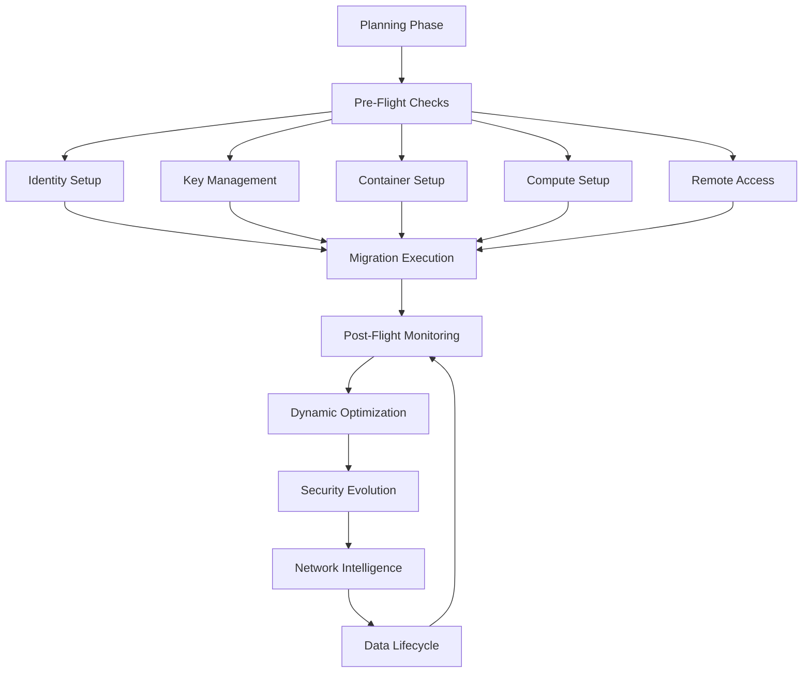

# Sirsi Nexus Comprehensive Design Blueprint (CDB)

A dense, end-to-end specification for a production-ready, agent-embedded migration orchestration platform.

## Current Development Status

### GUI-First Progress (Phase 1)

#### Completed Components:
- ✅ Basic layout structure (RootLayout, Header, Sidebar)
- ✅ Authentication components (AuthModal)
- ✅ Project management:
  - ✅ Projects list view
  - ✅ Project creation/editing
  - ✅ Project detail view
  - ✅ Task list component
  - ✅ Project analytics with charts
- ✅ Initial MigrationSteps wizard structure

#### In Progress:
- 🔄 Task management features:
  - ✅ TaskList component
  - 🔄 CreateTaskDialog (pending)
  - 🔄 EditTaskDialog (pending)
  - 🔄 Task form shared component (pending)
- 🔄 Agent integration features:
  - ✅ Basic AgentChat component
  - 🔄 Contextual tooltips
  - 🔄 Input field assistants

#### Pending:
- ⏳ Migration wizard steps implementation
- ⏳ Analytics & reporting features
- ⏳ Help & tutorial systems
- ⏳ Security dashboard
- ⏳ Integration with backend services

## 1. Core Capabilities & Design Principles

1. **Full-Stack AI Integration**: Every component embeds an agent for contextual assistance, code generation, and workflow optimization.
2. **Multi-Cloud Discovery**: Automated resource enumeration and relationship mapping across AWS, Azure, GCP, and vSphere.
3. **Risk-Aware Planning**: ML-powered assessment of migration complexity, cost, and security implications.
4. **Infrastructure as Code**: Automated generation and validation of Terraform, Bicep, and Pulumi templates.
5. **Event-Driven Architecture**: Kafka/NATS backbone for real-time progress tracking and agent coordination.
6. **Enterprise-Grade CI/CD & Testing**: Comprehensive GitHub Actions/Azure Pipelines setup for linting (Clippy, ESLint, GoLint), unit tests (Rust, Go, Python, Jest), integration tests (Testcontainers, KIND), end-to-end UI tests (Cypress), security scans (Snyk, Trivy), and performance baselining (K6, Lighthouse).

## 2. High-Level Architecture

```text
sirsi-nexus/
├── core-engine/               # Rust: AI hypervisor, sub-agent manager, state machine, gRPC server
├── connectors/                # Go: per-provider adapter runtimes (AWS, Azure, GCP, vSphere)
├── planner/                   # Python: Graph-of-Thought AI orchestration, Dagster pipelines, OPA + ML scorer
├── ui/                        # Next.js + React: pages, modals, dashboards, AgentChat widget
├── cli/                       # Tauri + Rust: local CLI with interactive REPL and agent prompts
├── subagents/                 # Shared logic for spawning and communicating with specialized agents
├── security/                  # OPA policies, SPIFFE/SPIRE configs, Vault templates
├── pipeline/                  # Kafka/NATS setup, OpenTelemetry collector, event schemas
├── migration-templates/       # Terraform, Bicep, Pulumi .tpl files for infrastructure generation
├── testing/                   # Testcontainers definitions, Cypress specs, performance scripts
├── ci/                        # Pipeline definitions, code coverage, security scans
└── deploy/                    # Helm charts, GitOps manifests, desktop bundle configs
```  

**Contracts**: All services share versioned proto definitions under `core-engine/proto/*.proto`. Events adhere to schemas in `pipeline/schemas/`.

## 2.1 GUI-First Development Approach

To keep the interface "alive" during early development, the project begins by scaffolding the entire UI and CLI with mocked data. Every screen, modal and dashboard is implemented first, then real services and sub-agents replace the placeholders incrementally. This approach validates workflows early and guides backend priorities.

## 3. Phase-by-Phase Roadmap

### Phase 0: Preparation & Monorepo Scaffolding
- Initialize a unified monorepo with Yarn Workspaces, Cargo Workspace, and Go Modules.
- Establish CI seeds: Actions matrix, semantic-release, branch protection rules.
- Draft a full Mermaid/PlantUML architecture diagram at `docs/architecture.mmd`.

### Phase 1: UI & CLI Foundations (Feature-Rich, Agent-Embedded)
#### 1.1 Design System & Navigation
- Tailwind config tokens for Sirsi palette and typography.
- `<Sidebar>` component with entries for each sub-agent's domain feature home: Overview, Migration Wizard, Credential Management, Projects, Migration Steps (Plan, Specify, Test, Build, Transfer, Validate, Optimize, Support), Analytics & Reports, Help & Tutorials.
- `<AgentChat>` overlay always available; contextual tooltips and input field assistants.

#### 1.2 Core Components & Screens
- **WelcomeModal**: JSON-driven steps, Framer Motion animations, embedded Agent greeting.
- **ProjectForm**: React Hook Form + Zod, real-time AI tips, immediate validation, icons in dropdowns.
- **AuthModal**: Tabbed Sign In/Register, OIDC flows, demo credentials section, AI prompt for MFA.
- **MigrationSteps**: Wizard flow with sub-agent interactions at each step, pre-populated real content from events.

#### 1.3 CLI Interface
- Tauri-based binary bundling Rust core and React UI.
- `sirsi` CLI with subcommands (`init`, `discover`, `assess`, `plan`, `run`, `status`, `help`) and interactive REPL mode with Agent autocompletion.

### Phase 2: Core AI Hypervisor & Sub-Agent Framework
1. **Hypervisor Core (Rust)**
   - Implement `AgentService` gRPC with methods: `StartSession`, `SpawnSubAgent(type)`, `SendMessage`, `GetSuggestions`, `GetSubAgentStatus`.
   - Context store: Redis cluster for session data, user profiles, and workspace state.
2. **Sub-Agent Manager**
   - Dynamic loading of sub-agent modules as WASM or Go binaries.
   - Domain-specific sub-agents: AzureAgent, AWSAgent, MigrationAgent, ReportingAgent, SecurityAgent, ScriptingAgent, TutorialAgent.
   - Communication bus: Agents publish and subscribe to Kafka topics: `agent.{domain}.requests`, `.responses`, `.logs`.
3. **Knowledge Graph Integration**
   - Hedera Hashgraph client in Rust to persist user interactions, resource graphs, and agent decisions as a 3D relationship map.
4. **Security Bootstrapping**
   - Configure SPIRE to issue mTLS certificates to each service and sub-agent.
   - Vault sidecar injector for dynamic secret retrieval, annotated in Kubernetes manifests.
5. **Observability Setup**
   - OpenTelemetry collector deployment, instrumentation of all services, and Kafka staging topics.

### Phase 3: Connector Framework & Discovery Sub-Agent
- Define `ConnectorRequest` and `ConnectorResponse` messages in `proto/connector.proto`.
- Implement AWSAgent, AzureAgent, GCPAgent, vSphereAgent in Go under `connectors/{provider}`.
- Each agent: Auth via SDK, resource enumeration, metadata enrichment, and publication to `discovery.events` with embedded AI prompts for optimization.
- Build a Go Testcontainers harness with LocalStack, Azurite, and Mock vSphere for CI integration tests.

### Phase 4: Assessment & Risk Sub-Agent
- Dagster pipelines in Python for `discovery.events` ingestion.
- OPA policies in `security/opa/` to evaluate compliance, sizing, OS support.
- ML-based scorer (`models/scorer.pkl`) to compute cost, performance, and security risk.
- Publish `assessment.events` with `riskScore`, `costEstimate`, `aiRecommendation`.
- AssessmentAgent listens for high-risk events and proactively messages users or opens action items.

### Phase 5: Migration Planning & Scripting Sub-Agent
- Template engine: Jinja2 (Python) & Tera (Rust) to fill `migration-templates/*.tpl` (Terraform HCL, Bicep, Pulumi TS).
- ScriptingAgent validates synthesized IaC, offers inline code-edit suggestions via AI, and writes back updated templates.
- Expose `/api/plan` endpoints for UI and CLI; generate Mermaid diagrams at `/api/plan/diagram`.

### Phase 6: Core User Flows, Agent Use Cases & No-Empty States
| Flow         | Entry Point                | Sub-Agent         | UI/CLI Behavior                                    |
|-------------|---------------------------|------------------|--------------------------------------------------|
| Registration | AuthModal (UI/CLI)        | AgentService     | Personalized greeting, role setup, onboarding tutorial. |
| Discovery    | Migration Wizard → Plan   | DiscoveryAgent   | Live resource list, filtering tips, no blank lists. |
| Assessment   | Migration Steps → Specify | AssessmentAgent  | Risk heatmap, AI explainers on hover, no empty cells. |
| Planning     | Migration Steps → Test    | PlanningAgent    | IaC snippets rendered, inline code editor, real diagram. |
| Execution    | Migration Steps → Build   | ExecutionAgent   | Progress logs, parallel task monitoring, alerts. |
| Transfer     | Migration Steps → Transfer| ExecutionAgent   | Transfer metrics, retry suggestions, error resolution. |
| Validation   | Migration Steps → Validate| ValidationAgent  | Health-check dashboard, anomaly summaries. |
| Optimization | Migration Steps → Optimize| OptimizationAgent| Cost and performance recommendations, carbon footprint metrics. |
| Reporting    | Analytics & Reports      | ReportingAgent   | Real-time charts, AI-written summaries, export options. |
| Security     | Security Dashboard       | SecurityAgent    | Compliance status, patch recommendations. |
| Scripting    | Scripting Console        | ScriptingAgent   | Code generation in Bicep/Terraform/YAML, live preview. |
| Tutorials    | Help & Tutorials         | TutorialAgent    | Interactive walkthroughs, video embeds, chatbot prompts.|

### Phase 7: Support, Monitoring & Continuous Learning
1. **Help Center**: FAQ and docs search via TutorialAgent and AgentChat.
2. **Dynamic Tutorials**: Contextual popovers and walkthroughs for every feature.
3. **Monitoring Dashboards**: Grafana + Prometheus with Agent-written daily/weekly summaries at `/api/metrics/summary`.
4. **Alerts & Notifications**: Slack, email, and in-app via NotificationAgent with triage suggestions.
5. **Feedback Loop**: Telemetry from sub-agents informs model retraining and policy refinement.

### Phase 8: Hardening, Packaging & Release
[Previous content remains unchanged...]

### Phase 9: Dynamic Environment Management & Continuous Optimization

#### Pre-Flight Planning Integration (Added to SpecifyStep)
During the planning phase, the system must establish:

1. **Identity & Access Architecture**
   - User/group management strategy
   - Role-based access control (RBAC) design
   - Privileged access management (PAM) framework
   - Directory service integration (AD/LDAP)
   - SSO and MFA requirements

2. **Key Management Infrastructure**
   - Certificate management strategy
   - Secret rotation policies
   - Hardware security module (HSM) requirements
   - Key lifecycle management
   - Encryption standards

3. **Container Orchestration Planning**
   - Container platform selection
   - Registry management strategy
   - Image security policies
   - Orchestration tool configuration
   - Service mesh requirements

4. **Compute Management Strategy**
   - Server fleet management approach
   - Serverless deployment strategy
   - Auto-scaling policies
   - Instance type selection
   - Resource tagging standards

5. **Remote Access Framework**
   - VPN infrastructure design
   - Bastion host strategy
   - Jump box configuration
   - Remote desktop solutions
   - Access monitoring approach

#### New Migration Steps:

##### IdentityManagementStep
Focus: User, group, and privilege management
Components:
- Identity Provider Integration
- Role Management System
- Access Review Automation
- Privilege Escalation Workflow
UI Elements:
- User/Group Management Console
- Role Assignment Matrix
- Access Review Dashboard
- Privilege Audit Logs
Monitoring:
- Access pattern analysis
- Privilege usage tracking
- Policy compliance checking
- Authentication metrics

##### KeyVaultStep
Focus: Key and secret management
Components:
- Certificate Lifecycle Manager
- Secret Rotation Engine
- HSM Integration
- Encryption Key Manager
UI Elements:
- Certificate Dashboard
- Key Rotation Status
- Secret Access Logs
- Compliance Status
Monitoring:
- Certificate expiration tracking
- Key usage patterns
- Secret access auditing
- Rotation compliance

##### ContainerOrchestrationStep
Focus: Container and registry management
Components:
- Registry Manager
- Image Scanner
- Deployment Orchestrator
- Service Mesh Controller
UI Elements:
- Container Dashboard
- Image Security Status
- Deployment Topology
- Service Mesh Visualizer
Monitoring:
- Container health metrics
- Image vulnerability scanning
- Resource utilization
- Service mesh telemetry

##### ComputeManagerStep
Focus: Server and serverless management
Components:
- Fleet Manager
- Serverless Deployment Engine
- Auto-scaling Controller
- Resource Optimizer
UI Elements:
- Fleet Management Console
- Serverless Function Dashboard
- Scaling Metrics Visualizer
- Resource Usage Analytics
Monitoring:
- Server health metrics
- Function execution stats
- Scaling event analysis
- Resource optimization opportunities

##### RemoteAccessStep
Focus: Remote access and connectivity
Components:
- VPN Manager
- Bastion Controller
- Access Gateway
- Session Manager
UI Elements:
- Connection Dashboard
- Access Request Console
- Session Monitor
- Audit Log Viewer
Monitoring:
- Connection metrics
- Session analysis
- Access patterns
- Security events

#### Additional Agent Types:

1. **IdentityAgent**
   - User behavior analysis
   - Access pattern recognition
   - Privilege recommendation
   - Compliance enforcement

2. **KeyManagementAgent**
   - Certificate lifecycle automation
   - Rotation scheduling
   - Access pattern analysis
   - Compliance monitoring

3. **ContainerAgent**
   - Image optimization
   - Security scanning
   - Resource allocation
   - Service mesh optimization

4. **ComputeAgent**
   - Fleet optimization
   - Serverless scaling
   - Resource prediction
   - Cost optimization

5. **AccessAgent**
   - Connection management
   - Access pattern analysis
   - Security enforcement
   - Session optimization

#### Cross-Cutting Concerns:

1. **Unified Monitoring**
   - Centralized logging
   - Metric aggregation
   - Alert correlation
   - Performance analytics

2. **Security Integration**
   - Zero-trust enforcement
   - Least privilege automation
   - Compliance automation
   - Threat detection

3. **Cost Management**
   - Resource optimization
   - License management
   - Usage analysis
   - Budget enforcement

4. **Disaster Recovery**
   - Backup automation
   - Recovery testing
   - Failover orchestration
   - Business continuity

#### Pre-Flight Checklist Integration:
Each step includes a pre-flight checklist that must be completed during planning:

1. **Identity Pre-Flight**
   - Directory service readiness
   - Role mapping completion
   - Access policy definition
   - Authentication method validation

2. **Key Management Pre-Flight**
   - HSM configuration
   - Initial key generation
   - Rotation policy definition
   - Backup procedure validation

3. **Container Pre-Flight**
   - Registry setup
   - Initial image scanning
   - Orchestration testing
   - Network policy validation

4. **Compute Pre-Flight**
   - Resource quota verification
   - Scaling policy definition
   - Monitoring configuration
   - Backup strategy validation

5. **Remote Access Pre-Flight**
   - VPN infrastructure testing
   - Bastion host configuration
   - Access policy validation
   - Monitoring setup verification

#### Post-Flight Monitoring & Evolution:

1. **Dynamic Resource Optimization**
   - ML-driven resource prediction
   - Auto-scaling optimization
   - Cost optimization automation
   - Multi-cloud resource balancing

2. **Security Evolution**
   - Continuous security posture assessment
   - Automated threat detection and response
   - Real-time compliance monitoring
   - Zero-trust architecture maintenance

3. **Network Intelligence**
   - Dynamic route optimization
   - Load balancer configuration
   - Traffic pattern analysis
   - Multi-region performance optimization

4. **Data Lifecycle Management**
   - Automated schema optimization
   - Dynamic storage tier adjustment
   - Backup strategy evolution
   - Performance tuning automation

#### Integration with Existing Flow:
These steps are integrated into the existing migration flow, with pre-flight considerations starting during the planning phase and post-flight monitoring continuing indefinitely after migration completion.



This completes the end-to-end lifecycle of the migration and ongoing management process.
1. **Security Hardening**:
   - Run full Snyk and Trivy scans across all containers.
   - Update SPIFFE/SPIRE policies based on production telemetry.
   - Add rate limiting and circuit breakers to all API endpoints.

2. **Performance Optimization**:
   - Run K6 load tests against core workflows.
   - Profile and optimize agent communication patterns.
   - Add Redis caching for frequent agent queries.

3. **Desktop Packaging**:
   - Bundle Tauri app for Windows, macOS, Linux.
   - Code sign all binaries and notarize macOS package.
   - Set up auto-updates via GitHub releases.

4. **Documentation**:
   - Architecture diagrams and sequence flows.
   - API references with Swagger/OpenAPI specs.
   - Deployment guides for Kubernetes and bare metal.
   - Video tutorials for key workflows.

5. **Release Process**:
   - Set up semantic-release for version management.
   - Write migration guides for breaking changes.
   - Configure Dependabot for dependency updates.
   - Establish SLA monitoring with PagerDuty.
